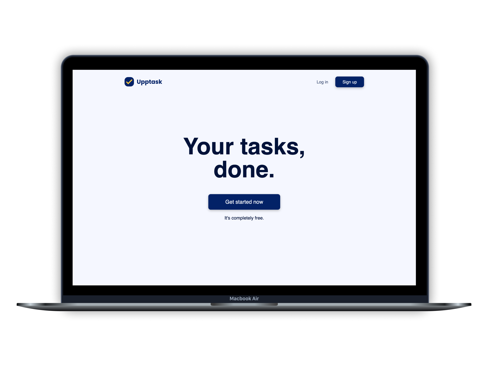
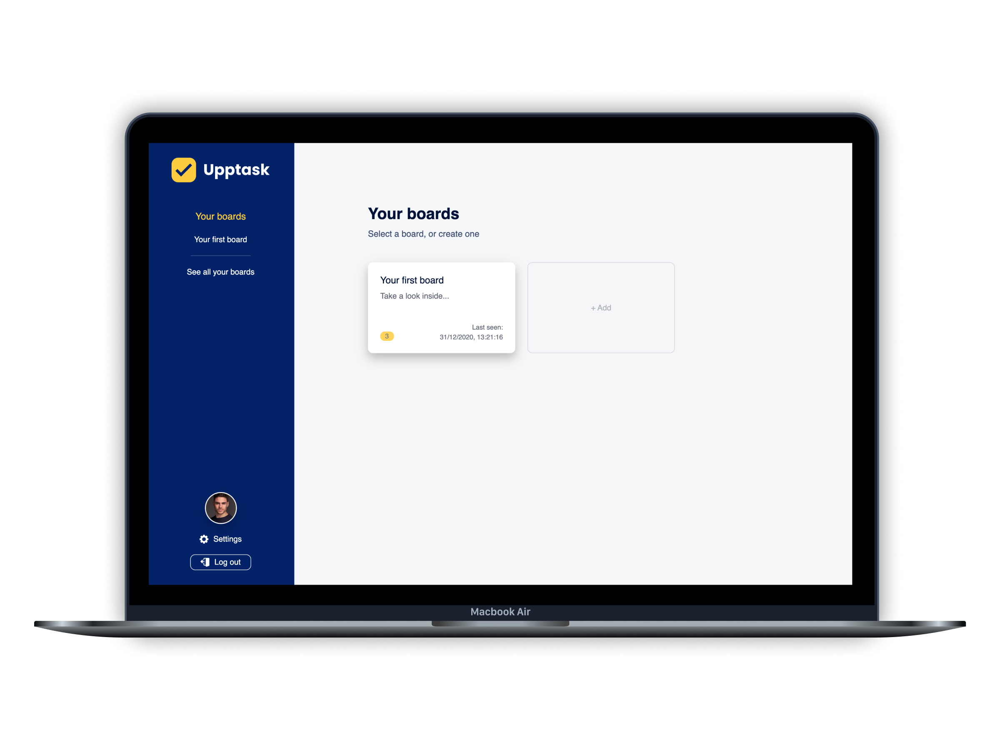
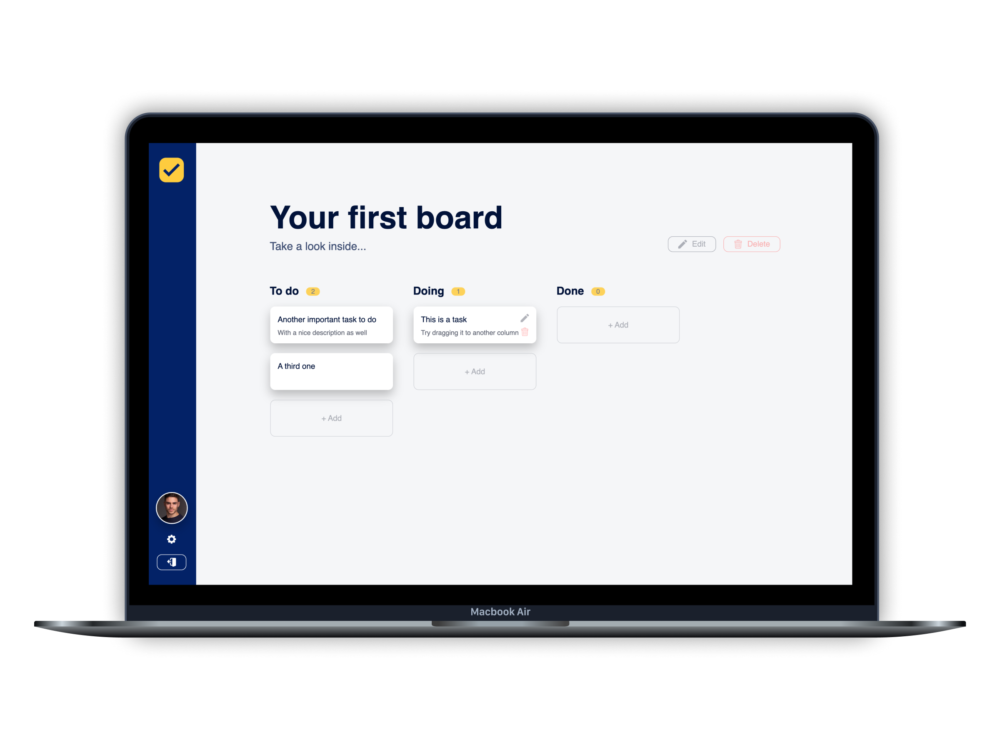

## Table of Contents

* [About the Project](#about)
    * [Built With](#built-using)
* [License](#license)

## About

SaaS product based on a Kanban system intended for desktop usage. Designed,
architectured and coded completely by me. Built with TypeScript - NextJS,
Styled-Components and Firebase for authentication and database (Firestore).

[View live](https://upptask.com/)

## Screenshots

### Built With

* [NestJS](https://nextjs.org/)
* [TypeScript](https://www.typescriptlang.org/)
* [Styled-Components](https://styled-components.com/)
* [Firebase](https://firebase.google.com/)

<!-- LICENSE -->
## License

&copy; Copyright 2020, Guillermo Gómez González
